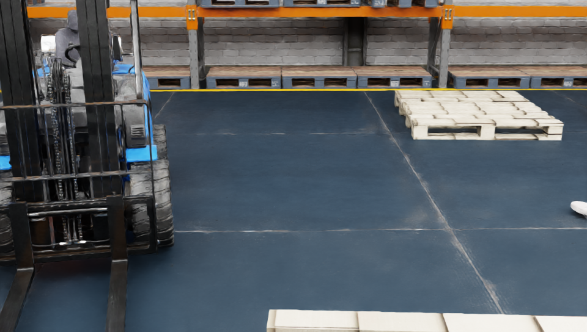
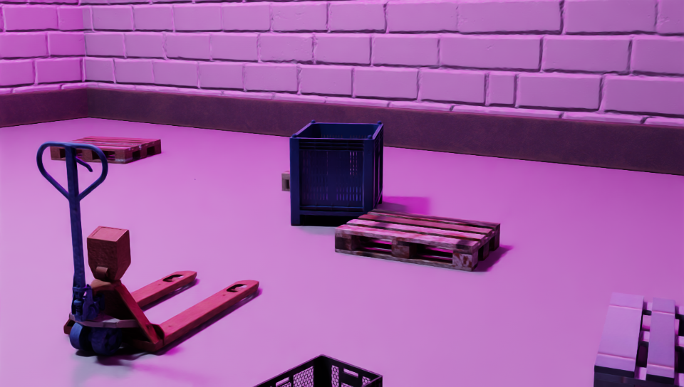
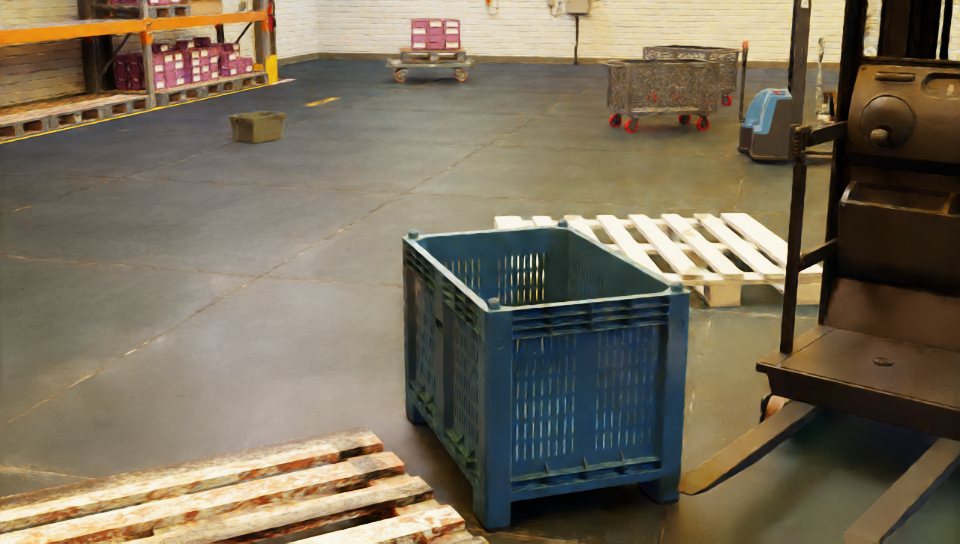
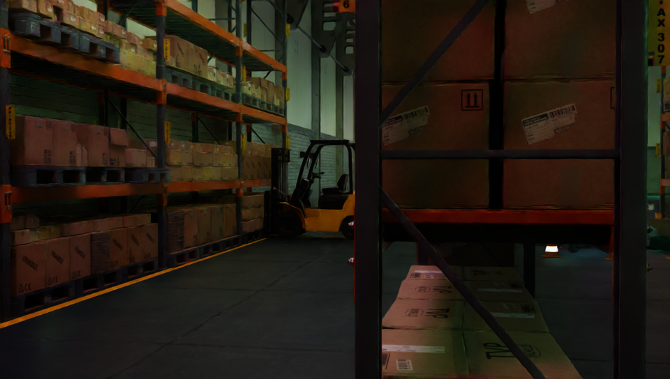

# IsaacSim-Autonomous-Forklift

  <b><i>Minho Lee; Jungwoo Lee; Wonhyeok Jeong; Jehwan Jeon; Chohui Shin</i></b>

    
    
    

## ✨ Abstract
This project integrates autonomous forklift control using Isaac Sim and ROS, enabling real-time monitoring and interaction. The system autonomously navigates, detects pallets, and accurately docks for transport in simulated warehouse environment.

    
    

### Overview of Pretraining Datasets: Real and Synthetic

|  |  |  |
|--------------------------------|--------------------------------|--------------------------------|
|  |  |  |

## 😎 TODOs
[O] Release data preparation scripts for logistics objects detection.  
[X] Release standalone python scripts for IsaacSim.  
[X] Release the main project code.