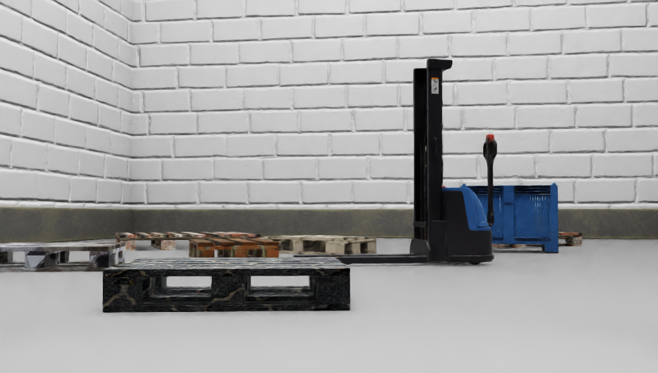
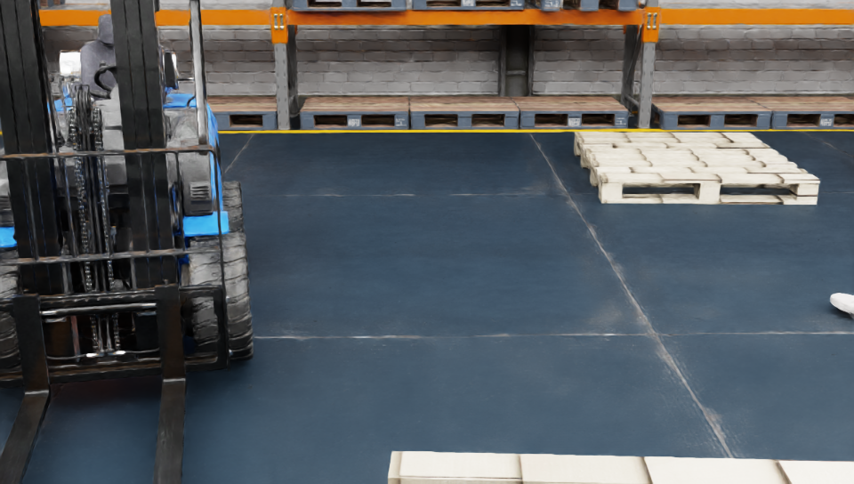
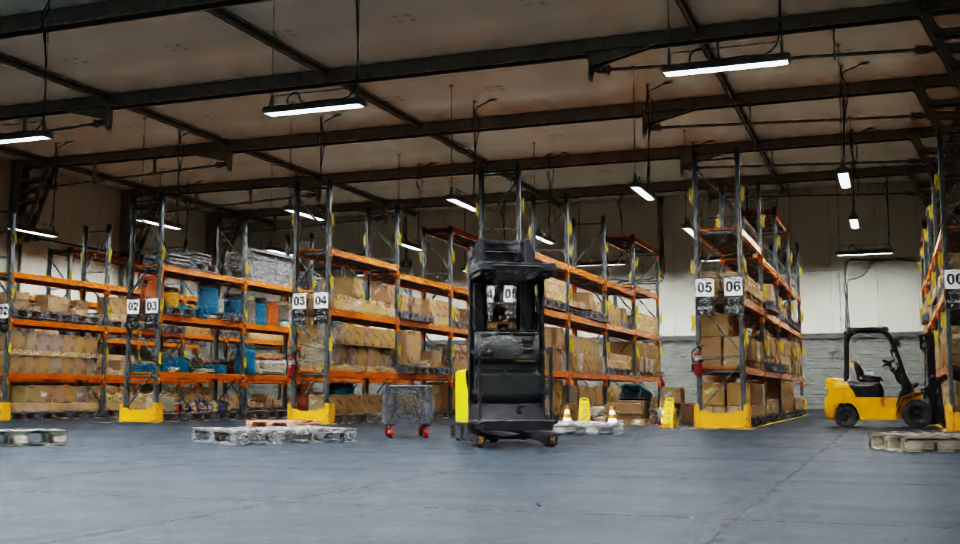
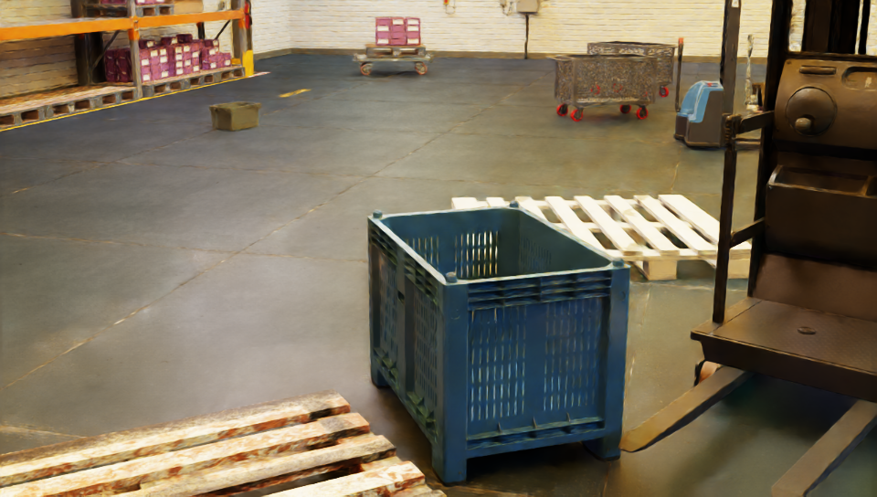
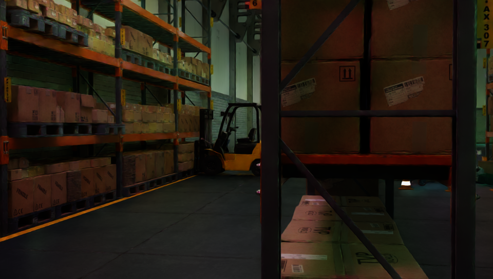
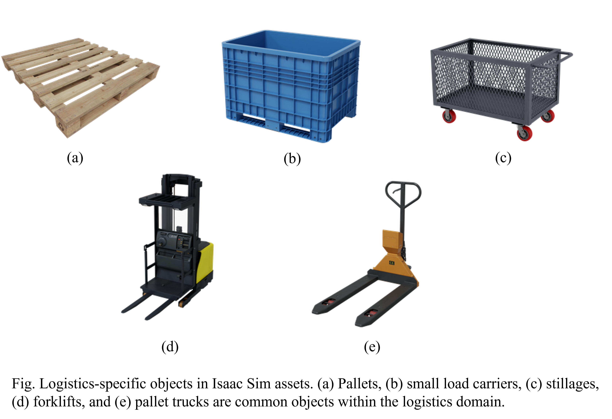
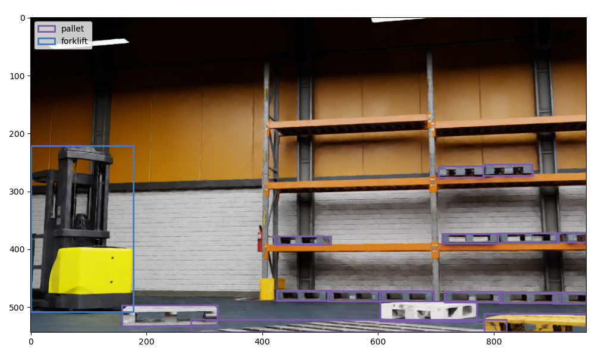
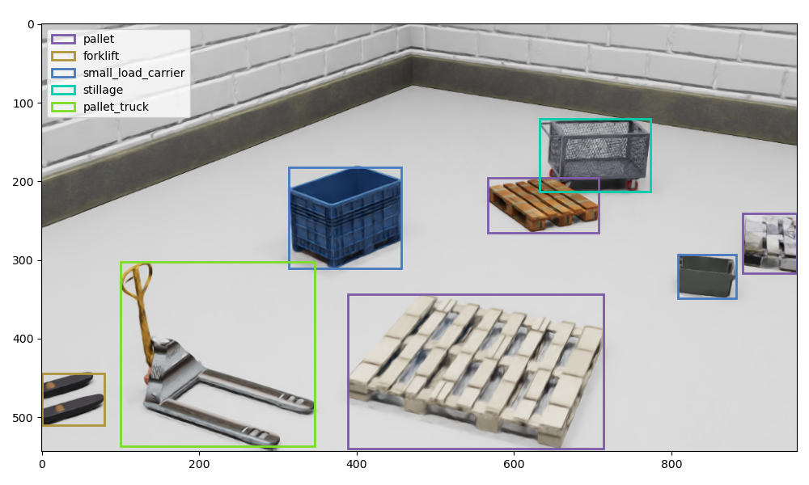

# Synthetic Data Generation

## 🚀 Quick Usage
To start generating synthetic data with default settings, use the following command:

```bash
cd ./sdg_src
./run_sdg.sh
```

**Note:** In the `Quick Usage` example, please make sure to modify the path `/home/user/` to match your own environment.

## 📌 Configuration

### 1. Examples of Generated Synthetic Data

<div align="center">

|  |  |  |
|--------------------------------|--------------------------------|--------------------------------|
|  |  |  |

</div>

### 2. Annotated Classes

<div align="center"></div>

<div align="center">

| **class**              | pallet | small_load_carrier | stillage | forklift | pallet_truck  |
|---------------------|:--------:|:----------:|:--------------:|:---------------------:|:----------:|
| **type**            | 3      | 5        | 4            | 5                   | 3        |

</div>

### 3. Environment Stages

<div align="center">

| **name**               | custom_warehouse | simple_warehouse | full_warehouse |
|:------------------:|:----------------:|:----------------:|:--------------:|
| **scale**          | (9,6,0)          | (8,14,0)         | (31,25,0)      |

</div>

### 4. Synthetic Data Generation Arguments

- `--headless` : Determines whether to run Isaac Sim without a GUI. Set to `True` for headless mode.
- `--stage_path` : Specifies the path to the environment (stage) file to be used. (Example: `/Isaac/Environments/Simple_Warehouse/warehouse.usd`)
- `--height` : Sets the height of the generated images.
- `--width` : Sets the width of the generated images.
- `--num_frames` : Specifies the number of frames to capture.
- `--data_dir` : Defines the directory path where the generated data will be saved.
- `--randomize_lighting` : Randomizes lighting settings to simulate various lighting conditions.
- `--randomize_floor_material` : Randomizes floor material for diverse floor textures in the environment.
- `--randomize_wall_material` : Randomizes wall material to simulate different wall textures.

### 5. Visualization of Labled Synthetic Data

```bash
cd ./sdg_src/scripts
python synthetic_data_visualize.py
```
In the `viz_result` directory, you can find visualization results that show information from the label data(`.npy`, `.json`), including bounding boxes and class details.

<p align="center">
    
    
</p>

## ✨ Relevant Links
* [[1] NVIDIA Omniverse Docs: Replicator_tutorials](https://docs.omniverse.nvidia.com/isaacsim/latest/replicator_tutorials/)
* [[2] NVIDIA Omni Replicator 1.11.6 documentation ](https://docs.omniverse.nvidia.com/py/replicator/1.11.16/index.html)
* [[3] How to Train Autonomous Mobile Robots to Detect Warehouse Pallet Jacks Using Synthetic Data](https://developer.nvidia.com/blog/how-to-train-autonomous-mobile-robots-to-detect-warehouse-pallet-jacks-using-synthetic-data/)
* [[4] Synthetic Data Generation and Training Workflow](https://github.com/NVIDIA-AI-IOT/synthetic_data_generation_training_workflow)